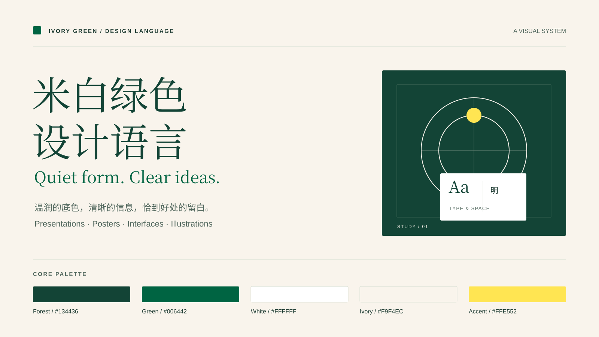

# 米白绿色设计语言

**Ivory Green Design Language** — 用米白、森林绿与编辑式排版，建立清晰、温润、有分寸的视觉作品。



这是一套可供 AI 助手使用的设计 skill，也是一份能直接阅读的跨媒介设计指南。它统一配色角色、字体搭配和视觉节奏，同时为不同媒介调整尺寸与信息密度。

## 适用场景

| 媒介 | 包含的指导 |
| --- | --- |
| PPT / 演示文稿 | 页面骨架、字号、母版、原生可编辑内容与导出检查 |
| Photoshop / 海报 | 数字与印刷画布、层级、图层分组、智能对象及输出 |
| UI / 网页 | 字体层级、控件状态、响应式布局、键盘使用与克制交互 |
| 插画 / 配图 | 构图、材质、留白与图像生成提示词 |
| 图表 / 图解 | 精确文字、线条关系、数据表达与矢量源文件 |

## 快速开始

将整个文件夹保存为 `ivory-green-design-language`，放进支持 `SKILL.md` 的工具的技能目录。Codex 的默认个人技能目录为 `~/.codex/skills/`；若配置了其他 `CODEX_HOME`，使用其 `skills/` 目录。让工具重新加载技能后调用：

```text
使用 $ivory-green-design-language，把这份内容制作成 16:9 演示文稿。
使用米白绿色设计语言，设计一张竖版海报，保留可编辑文字与图层。
使用米白绿色设计语言，为这个界面调整视觉，保留现有功能。
```

没有 skill 机制的工具也可以直接阅读 [SKILL.md](SKILL.md)，按其中链接加载需要的指南。不必一次加载所有文件。

## 内容导航

- [Skill 入口](SKILL.md)：适用范围、工作方式和视觉特征。
- [视觉基础](references/design-system.md)：颜色、字体、间距、构图和动效。
- [跨媒介制作指南](references/media-guides.md)：PPT、海报/PSD、UI、图像/图解、网页。
- [提示词配方](references/prompt-recipes.md)：可直接修改使用的任务说明。
- [验收清单](references/quality-checks.md)：按实际交付格式检查成品。
- [资源目录](references/assets.md)：设计参数、CSS、HTML 交互样张和 SVG 模板。

下载整个仓库后，直接用浏览器打开 `assets/starter.html`，可以切换样张底色、调整字号、查看矢量版式和体验自检交互。无需安装依赖或连接网络；在 GitHub 文件页中查看 HTML 源码不会运行交互。

## 资源与格式说明

配色的机器可读起点在 [tokens.json](assets/tokens.json)。模板包括 16:9 演示版式、竖版海报和流程图解。SVG 保留文字与分组；它们是矢量源文件，并不是原生 PPTX 或 PSD。

这个 skill 指导如何制作相应格式，不自带 PowerPoint 或 Photoshop 渲染引擎。原生 PPTX、分层 PSD 和其他文件需要当前环境中相应的制作工具。字体采用设备可用的回退字族，不捆绑或再分发字体文件。

公开内容仅包含通用设计规范与全新中性示例，不含公司案例、产品资料、客户信息、内部数据或原业务文档。

## 许可

本仓库新编写的说明、代码和 SVG 模板采用 [MIT License](LICENSE)。字体与用户后来导入的素材遵循各自许可。
